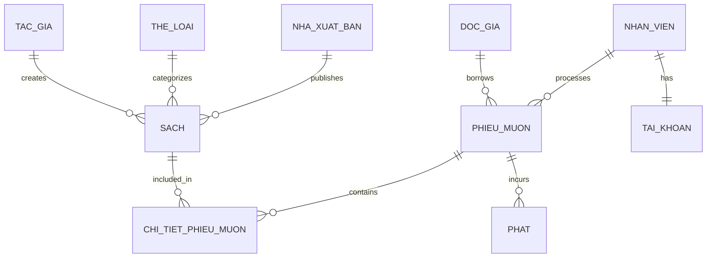

# Database Schema Documentation

## Tổng Quan

Database `QuanLyThuVien` được thiết kế theo mô hình Relational Database với 10 bảng chính, hỗ trợ đầy đủ các chức năng quản lý thư viện.

## Sơ Đồ Quan Hệ (ERD)

## Bảng Chi Tiết

### 1. TAC_GIA (Authors)
**Mô tả**: Lưu thông tin tác giả của sách

| Cột | Kiểu | Ràng buộc | Mô tả |
|-----|------|-----------|-------|
| MaTacGia | INT | PK, IDENTITY | Mã tác giả (tự động tăng) |
| TenTacGia | NVARCHAR(100) | NOT NULL | Tên tác giả |
| NgaySinh | DATE | NULL | Ngày sinh |
| QuocTich | NVARCHAR(50) | NULL | Quốc tịch |
| TieuSu | NVARCHAR(MAX) | NULL | Tiểu sử tác giả |
| NgayTao | DATETIME | DEFAULT GETDATE() | Ngày tạo record |
| NgayCapNhat | DATETIME | DEFAULT GETDATE() | Ngày cập nhật |

**Indexes**: None (Small table)

---

### 2. THE_LOAI (Categories)
**Mô tả**: Phân loại sách theo thể loại

| Cột | Kiểu | Ràng buộc | Mô tả |
|-----|------|-----------|-------|
| MaTheLoai | INT | PK, IDENTITY | Mã thể loại |
| TenTheLoai | NVARCHAR(100) | NOT NULL, UNIQUE | Tên thể loại |
| MoTa | NVARCHAR(500) | NULL | Mô tả thể loại |
| NgayTao | DATETIME | DEFAULT GETDATE() | Ngày tạo |

**Indexes**: UNIQUE on TenTheLoai

---

### 3. NHA_XUAT_BAN (Publishers)
**Mô tả**: Thông tin nhà xuất bản

| Cột | Kiểu | Ràng buộc | Mô tả |
|-----|------|-----------|-------|
| MaNhaXuatBan | INT | PK, IDENTITY | Mã nhà xuất bản |
| TenNhaXuatBan | NVARCHAR(200) | NOT NULL | Tên nhà xuất bản |
| DiaChi | NVARCHAR(300) | NULL | Địa chỉ |
| SoDienThoai | VARCHAR(15) | NULL | Số điện thoại |
| Email | VARCHAR(100) | NULL | Email liên hệ |
| NgayTao | DATETIME | DEFAULT GETDATE() | Ngày tạo |
| NgayCapNhat | DATETIME | DEFAULT GETDATE() | Ngày cập nhật |

---

### 4. NHAN_VIEN (Staff)
**Mô tả**: Thông tin nhân viên thư viện

| Cột | Kiểu | Ràng buộc | Mô tả |
|-----|------|-----------|-------|
| MaNhanVien | INT | PK, IDENTITY | Mã nhân viên |
| HoTen | NVARCHAR(100) | NOT NULL | Họ tên |
| ChucVu | NVARCHAR(50) | NOT NULL | Chức vụ |
| NgaySinh | DATE | NULL | Ngày sinh |
| GioiTinh | NVARCHAR(10) | NULL | Giới tính |
| DiaChi | NVARCHAR(300) | NULL | Địa chỉ |
| SoDienThoai | VARCHAR(15) | NULL | Số điện thoại |
| Email | VARCHAR(100) | NULL | Email |
| NgayVaoLam | DATETIME | DEFAULT GETDATE() | Ngày vào làm |
| TrangThai | NVARCHAR(20) | DEFAULT 'Đang làm việc' | Trạng thái |
| NgayTao | DATETIME | DEFAULT GETDATE() | Ngày tạo record |

---

### 5. DOC_GIA (Readers)
**Mô tả**: Thông tin độc giả đăng ký

| Cột | Kiểu | Ràng buộc | Mô tả |
|-----|------|-----------|-------|
| MaDocGia | VARCHAR(20) | PK | Mã độc giả |
| HoTen | NVARCHAR(100) | NOT NULL | Họ tên |
| NgaySinh | DATE | NULL | Ngày sinh |
| GioiTinh | NVARCHAR(10) | NULL | Giới tính |
| DiaChi | NVARCHAR(300) | NULL | Địa chỉ |
| SoDienThoai | VARCHAR(15) | NULL | Số điện thoại |
| Email | VARCHAR(100) | NULL | Email |
| CMND | VARCHAR(20) | UNIQUE | Số CMND/CCCD |
| NgayDangKy | DATETIME | DEFAULT GETDATE() | Ngày đăng ký |
| NgayHetHan | DATETIME | NULL | Ngày hết hạn thẻ |
| TrangThai | NVARCHAR(50) | DEFAULT 'Hoạt động' | Trạng thái |
| GhiChu | NVARCHAR(500) | NULL | Ghi chú |

**Indexes**:
- IX_DOC_GIA_TEN (HoTen)
- IX_DOC_GIA_SDT (SoDienThoai)
- IX_DOC_GIA_TRANG_THAI (TrangThai)

**Business Rules**:
- Thẻ có hiệu lực 1 năm kể từ ngày đăng ký
- Chỉ độc giả có TrangThai = 'Hoạt động' mới được mượn sách

---

### 6. SACH (Books)
**Mô tả**: Thông tin sách trong thư viện

| Cột | Kiểu | Ràng buộc | Mô tả |
|-----|------|-----------|-------|
| MaSach | VARCHAR(20) | PK | Mã sách |
| TenSach | NVARCHAR(200) | NOT NULL | Tên sách |
| MaTacGia | INT | FK → TAC_GIA | Tác giả |
| MaTheLoai | INT | FK → THE_LOAI | Thể loại |
| MaNhaXuatBan | INT | FK → NHA_XUAT_BAN | Nhà xuất bản |
| NamXuatBan | INT | CHK: 1000-YEAR+1 | Năm xuất bản |
| SoLuongTon | INT | DEFAULT 0, CHK ≥ 0 | Số lượng tồn kho |
| ViTri | NVARCHAR(50) | NULL | Vị trí trên kệ |
| TrangThai | NVARCHAR(50) | DEFAULT 'Có sẵn' | Trạng thái |
| MoTa | NVARCHAR(MAX) | NULL | Mô tả sách |
| GiaTien | DECIMAL(18,2) | NULL | Giá tiền |
| NgayNhap | DATETIME | DEFAULT GETDATE() | Ngày nhập kho |

**Indexes**:
- IX_SACH_TEN (TenSach)
- IX_SACH_TAC_GIA (MaTacGia)
- IX_SACH_THE_LOAI (MaTheLoai)
- IX_SACH_TRANG_THAI (TrangThai)

**Constraints**:
- FK_SACH_TAC_GIA
- FK_SACH_THE_LOAI
- FK_SACH_NHA_XUAT_BAN
- CHK_SACH_NAM (NamXuatBan BETWEEN 1000 AND YEAR+1)
- CHK_SACH_SOLUONG (SoLuongTon >= 0)

---

### 7. TAI_KHOAN (User Accounts)
**Mô tả**: Tài khoản đăng nhập hệ thống

| Cột | Kiểu | Ràng buộc | Mô tả |
|-----|------|-----------|-------|
| MaTaiKhoan | INT | PK, IDENTITY | Mã tài khoản |
| TenDangNhap | VARCHAR(50) | NOT NULL, UNIQUE | Tên đăng nhập |
| MatKhau | VARCHAR(255) | NOT NULL | Mật khẩu (hashed) |
| MaNhanVien | INT | FK → NHAN_VIEN | Nhân viên sở hữu |
| QuyenHan | NVARCHAR(50) | DEFAULT 'Nhân viên' | Quyền hạn |
| TrangThai | NVARCHAR(20) | DEFAULT 'Hoạt động' | Trạng thái |
| NgayTao | DATETIME | DEFAULT GETDATE() | Ngày tạo |
| LanDangNhapCuoi | DATETIME | NULL | Lần đăng nhập cuối |

**Constraints**:
- FK_TAI_KHOAN_NHAN_VIEN
- UNIQUE (TenDangNhap)

**Security**:
- Mật khẩu phải được hash (BCrypt hoặc SHA-256)
- Quyền hạn: 'Quản trị viên', 'Thủ thư', 'Nhân viên'

---

### 8. PHIEU_MUON (Borrow Receipts)
**Mô tả**: Phiếu mượn sách của độc giả

| Cột | Kiểu | Ràng buộc | Mô tả |
|-----|------|-----------|-------|
| MaPhieuMuon | VARCHAR(20) | PK | Mã phiếu mượn |
| MaDocGia | VARCHAR(20) | FK → DOC_GIA | Độc giả mượn |
| MaNhanVien | INT | FK → NHAN_VIEN | Nhân viên xử lý |
| NgayMuon | DATETIME | DEFAULT GETDATE() | Ngày mượn |
| HanTra | DATETIME | NOT NULL | Hạn trả |
| NgayTraThucTe | DATETIME | NULL | Ngày trả thực tế |
| TrangThai | NVARCHAR(50) | DEFAULT 'Đang mượn' | Trạng thái |
| GhiChu | NVARCHAR(500) | NULL | Ghi chú |

**Indexes**:
- IX_PHIEU_MUON_DOC_GIA (MaDocGia)
- IX_PHIEU_MUON_NGAY (NgayMuon)
- IX_PHIEU_MUON_TRANG_THAI (TrangThai)

**Constraints**:
- FK_PHIEU_MUON_DOC_GIA
- FK_PHIEU_MUON_NHAN_VIEN
- CHK_PHIEU_MUON_NGAY (HanTra > NgayMuon)

**Business Rules**:
- Thời hạn mượn mặc định: 14 ngày
- Độc giả tối đa 5 quyển sách cùng lúc
- Trạng thái: 'Đang mượn', 'Đã trả', 'Quá hạn'

---

### 9. CHI_TIET_PHIEU_MUON (Borrow Details)
**Mô tả**: Chi tiết sách trong mỗi phiếu mượn

| Cột | Kiểu | Ràng buộc | Mô tả |
|-----|------|-----------|-------|
| MaChiTiet | INT | PK, IDENTITY | Mã chi tiết |
| MaPhieuMuon | VARCHAR(20) | FK → PHIEU_MUON | Phiếu mượn |
| MaSach | VARCHAR(20) | FK → SACH | Sách mượn |
| SoLuong | INT | DEFAULT 1, CHK > 0 | Số lượng |
| TinhTrangMuon | NVARCHAR(100) | DEFAULT 'Tốt' | Tình trạng lúc mượn |
| TinhTrangTra | NVARCHAR(100) | NULL | Tình trạng lúc trả |
| NgayTra | DATETIME | NULL | Ngày trả từng sách |

**Indexes**:
- IX_CHI_TIET_PHIEU (MaPhieuMuon)
- IX_CHI_TIET_SACH (MaSach)

**Constraints**:
- FK_CHI_TIET_PHIEU_MUON
- FK_CHI_TIET_SACH
- CHK_CHI_TIET_SOLUONG (SoLuong > 0)

---

### 10. PHAT (Fines)
**Mô tả**: Quản lý các khoản phạt

| Cột | Kiểu | Ràng buộc | Mô tả |
|-----|------|-----------|-------|
| MaPhat | INT | PK, IDENTITY | Mã phạt |
| MaPhieuMuon | VARCHAR(20) | FK → PHIEU_MUON | Phiếu mượn |
| LyDo | NVARCHAR(500) | NOT NULL | Lý do phạt |
| SoTienPhat | DECIMAL(18,2) | NOT NULL, CHK ≥ 0 | Số tiền phạt |
| NgayPhat | DATETIME | DEFAULT GETDATE() | Ngày phạt |
| TrangThaiThanhToan | NVARCHAR(50) | DEFAULT 'Chưa thanh toán' | Trạng thái |
| NgayThanhToan | DATETIME | NULL | Ngày thanh toán |

**Indexes**:
- IX_PHAT_PHIEU_MUON (MaPhieuMuon)
- IX_PHAT_TRANG_THAI (TrangThaiThanhToan)

**Constraints**:
- FK_PHAT_PHIEU_MUON
- CHK_PHAT_SOTIEN (SoTienPhat >= 0)

**Business Rules**:
- Phạt trễ hạn: 5,000 VNĐ/ngày/sách
- Phạt hư hỏng: Theo giá trị sách
- Phạt mất sách: 100% giá trị + phí xử lý

---

## Stored Procedures

### sp_QuanLySach.sql
- `sp_TimKiemSach` - Tìm kiếm sách nâng cao
- `sp_ThemSach` - Thêm sách mới
- `sp_CapNhatTonKho` - Cập nhật tồn kho (with transaction)

### sp_MuonTraSach.sql
- `sp_TaoPhieuMuon` - Tạo phiếu mượn (validate business rules)
- `sp_ThemSachVaoPhieuMuon` - Thêm sách vào phiếu
- `sp_TraSach` - Xử lý trả sách (tự động tính phạt)
- `sp_XemSachQuaHan` - Danh sách sách quá hạn

### sp_BaoCao.sql
- `sp_SachMuonNhieuNhat` - Top N sách mượn nhiều
- `sp_ThongKeTheoTheLoai` - Thống kê theo thể loại
- `sp_DocGiaTichCuc` - Top N độc giả tích cực
- `sp_BaoCaoDoanhThu` - Báo cáo doanh thu phạt
- `sp_BaoCaoTonKho` - Báo cáo tồn kho + cảnh báo

---

## Data Dictionary

### Quy Ước Đặt Tên

| Thành phần | Convention | Ví dụ |
|------------|------------|-------|
| Bảng | UPPER_SNAKE_CASE | PHIEU_MUON |
| Cột | PascalCase | MaDocGia, TenSach |
| Stored Procedure | sp_PascalCase | sp_TimKiemSach |
| Index | IX_TABLE_COLUMN | IX_SACH_TEN |
| Foreign Key | FK_TABLE1_TABLE2 | FK_SACH_TAC_GIA |
| Check Constraint | CHK_TABLE_COL | CHK_SACH_SOLUONG |

### Kiểu Dữ Liệu

- **ID tự tăng**: INT IDENTITY
- **Mã định danh**: VARCHAR(20)
- **Tên, mô tả tiếng Việt**: NVARCHAR
- **Email, phone**: VARCHAR
- **Ngày giờ**: DATETIME
- **Tiền**: DECIMAL(18,2)

---

## Performance Optimization

### Indexes Strategy
- Primary Keys: Clustered index (tự động)
- Foreign Keys: Non-clustered index
- Search fields: Non-clustered index (TenSach, TenTacGia, etc.)
- Status fields: Non-clustered index (TrangThai)

### Query Optimization Tips
- Sử dụng stored procedures thay vì dynamic SQL
- Parameterized queries để tránh SQL injection
- Transaction cho operations update nhiều tables
- Connection pooling

---

## Backup & Maintenance

### Backup Schedule
- **Full backup**: Hàng tuần (Chủ nhật 2AM)
- **Differential backup**: Hàng ngày (2AM)
- **Transaction log backup**: Mỗi 4 giờ

### Maintenance Tasks
- **Update statistics**: Weekly
- **Rebuild indexes**: Monthly
- **Check database integrity**: Weekly
- **Purge old logs**: Monthly (giữ 6 tháng)

---

**Version**: 1.0  
**Last Updated**: 19/12/2025  
**Database**: QuanLyThuVien  
**SQL Server**: 2016+
